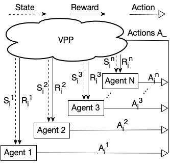

# SolarTrader

#### SolarTrader: Enabling Distributed Solar Energy Trading in Residential Virtual Power Plants

Yuzhou Feng, Qi Li, Dong Chen, and Raju Rangaswami.

In Proc. of the 7th ACM International Conference on Systems for Energy-Efficient Built Environments (BuildSys 2020), Acceptance Rate = 24.3%.

Distributed solar energy resources (DSERs) in smart grid are rapidly increasing due to the steep decline in solar module prices. is DSERs penetration has been playing pressure on the utilities to balance electricity’s real-time supply and demand. Recently, there is a rising interest to develop a cost-effective approach virtual power plants (VPPs) that enable solar generated energy trading to mitigate the impacts of the internment distributed DSERs and take advantage of distributed generation from DSERs for more reliable and profitable grid management. However, the existing trading approaches in residential VPPs do not actually allow DSER users to trade their surplus solar energy concurrently to achieve their maximum benefits, and typically require a trusted third-party to play the role of middleman online. In addition, due to a lack of fair trading algorithms, these approaches do not necessarily result in “fair” solar energy saving among all the VPP users for long term.

To address these problems, we design a new solar energy trading system - SolarTrader that enables unsupervised, distributed, and long term fair solar energy trading in residential VPPs. In essence, SolarTrader leverages a new multiple-agent deep reinforcement learning approach that enables Peer-to-Peer solar energy trading among different DSERs to ensure both the DSER users and the VPPs to achieve maximum benefits equally and simultaneously. We implement our SolarTrader and evaluate it using both synthetic and real smart meter data from 4 U.S. residential VPP communities that are comprised of ∼229 residential DSERs in total. Our results show that SolarTrader can reduce the aggregated VPP energy consumption by 83.8% than the non-trading approach. In addition, we show that SolarTrader achieves ∼105% average saving in VPP residents’ monthly electricity cost. We also nd that SolarTrader— enabled VPPs can achieve a Gini Coecient (a standard measure of an approach’s fairness performance) as 0.05, which is the same as the best fairness Round-Robin approach. We will release all the datasets and source code of SolarTrader to the research community.

<div align="center"> 
    
    <p>The overview of the multi-agent deep reinforcement learning process in SolarTrader.</p>
</div>

#### [Project Website](https://cps.cs.fiu.edu/projects/solartrader-project/)

## Datasets

* [Pecan Street](https://www.pecanstreet.org/)
* [eGauge](https://www.egauge.net/)

## Pre-request Environment

### Environment Requirement

python3.7 or higher version is required.

### Setup Environment
1. Install virtual environment
```
pip install virtualenv
```

2. Create venv directory
```
python3 -m venv .venv
```

3. Activate virtual environment
* For Linux/Mac
```
source .venv/bin/activate
```
* For Windows
```
.\.venv\Scripts\activate
```

4. Install packages from requirements.txt
```
pip install -r requirements.txt
```

5. Deactivate virtual environment
```
deactivate
```